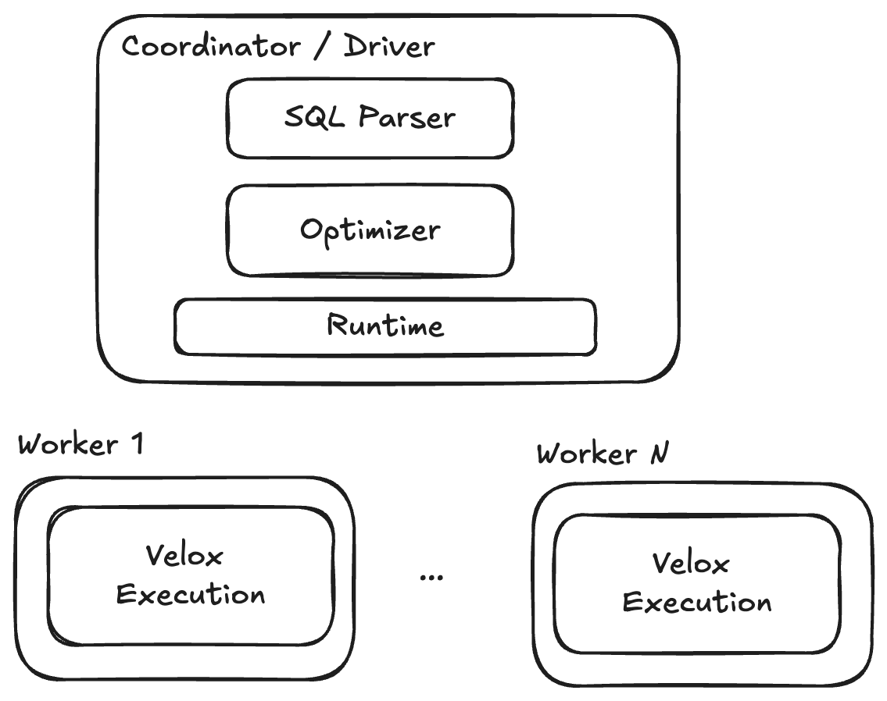
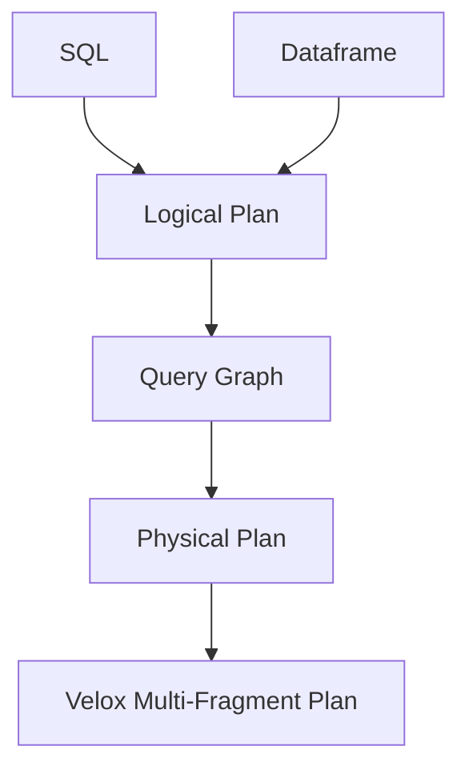

Axiom is an experimental frontend for the Velox ecosystem.

## License

Axiom is licensed under the Apache 2.0 License. A copy of the license
[can be found here.](LICENSE)

## Code Organization

Axiom is a collection of reusable extensible Velox-compatible components that can be used to put together front-end to Velox-powered query execution. These components include:

* SQL Parser compatible with PrestoSQL dialect.
  * top-level “sql” directory
* Logical Plan - a representation of SQL relations and expressions.
  * top-level “loglcal_plan” directory
* Cost-based [Optimizer](axiom/optimizer/README.md) compatible with Velox execution.
  * top-level “optimizer” directory
* Query Runner capable of orchestrating multi-stage Velox execution.
  * top-level “runner” directory
* Connector - an extention of Velox Connector APIs to provide functionality necessary for query parsing and planning.
  * top-level “connectors” directory

These components can be used to put together single-node or distributed execution. Single-node execution can be single-threaded or multi-threaded.



An example of an end-to-end single-node system is a command line utility that provides interactive SQL query execution against in-memory TPC-H dataset and Hive dataset stored on local disk. The code is located in the top-level directory “cli”. To launch, run

```
$ buck run @mode/opt axiom/cli:cli

or

$ ./axiom_sql
```

Type SQL query at the prompt, finish with a semi-colon and a newline:

```
SQL> desc nation;
ROW<column:VARCHAR,type:VARCHAR>
------------+--------
column      | type
------------+--------
n_nationkey | BIGINT
n_name      | VARCHAR
n_regionkey | BIGINT
n_comment   | VARCHAR
(4 rows in 4 batches)

SQL> select count(*) from nation;
ROW<count:BIGINT>
-----
count
-----
   25
(1 rows in 1 batches)
```

The query processing flow goes like this:



SQL Parser parses the query into Abstract Syntax Tree (AST), then resolves names and types to produce a Logical Plan. The Optimizer takes a Logical Plan and produces an optimized executable multi-fragment Velox plan. Finally, LocalRunner creates and executed Velox tasks to produce a query result.

EXPLAIN command can be used to print an optimized multi-fragment Velox plan without executing it.

```
SQL> explain  select count(*) from nation;
Fragment 0: stage1 numWorkers=4:
-- PartitionedOutput[2][SINGLE Presto] -> count:BIGINT
  -- Aggregation[1][PARTIAL count := count()] -> count:BIGINT
    -- TableScan[0][table: nation, scale factor: 0.01] ->
       Estimate: 25 rows, 0B peak memory

Fragment 1:  numWorkers=1:
-- Aggregation[5][FINAL count := count("count")] -> count:BIGINT
  -- LocalPartition[4][GATHER] -> count:BIGINT
    -- Exchange[3][Presto] -> count:BIGINT
       Input Fragment 0
```

EXPLAIN ANALYZE command can be used to execute the query and print Velox plan annotated with runtime statistics.

```
SQL> explain analyze select count(*) from nation;
Fragment 0: stage1 numWorkers=4:
-- PartitionedOutput[2][SINGLE Presto] -> count:BIGINT
   Output: 16 rows (832B, 16 batches), Cpu time: 545.76us, Wall time: 643.00us, Blocked wall time: 0ns, Peak memory: 16.50KB, Memory allocations: 80, Threads: 16, CPU breakdown: B/I/O/F (56.46us/91.04us/369.00us/29.26us)
  -- Aggregation[1][PARTIAL count := count()] -> count:BIGINT
     Output: 16 rows (512B, 16 batches), Cpu time: 548.82us, Wall time: 619.02us, Blocked wall time: 0ns, Peak memory: 64.50KB, Memory allocations: 80, Threads: 16, CPU breakdown: B/I/O/F (48.04us/18.53us/451.92us/30.33us)
    -- TableScan[0][table: nation, scale factor: 0.01] ->
       Estimate: 25 rows, 0B peak memory
       Input: 25 rows (0B, 1 batches), Output: 25 rows (0B, 1 batches), Cpu time: 1.43s, Wall time: 1.43s, Blocked wall time: 7.20ms, Peak memory: 97.75KB, Memory allocations: 10, Threads: 16, Splits: 1, CPU breakdown: B/I/O/F (24.86us/0ns/1.43s/4.46us)

Fragment 1:  numWorkers=1:
-- Aggregation[5][FINAL count := count("count")] -> count:BIGINT
   Output: 1 rows (32B, 1 batches), Cpu time: 72.03us, Wall time: 84.37us, Blocked wall time: 0ns, Peak memory: 64.50KB, Memory allocations: 5, Threads: 1, CPU breakdown: B/I/O/F (8.22us/53.59us/6.62us/3.60us)
  -- LocalPartition[4][GATHER] -> count:BIGINT
     Output: 32 rows (384B, 8 batches), Cpu time: 153.32us, Wall time: 1.16ms, Blocked wall time: 1.42s, Peak memory: 0B, Memory allocations: 0, CPU breakdown: B/I/O/F (20.37us/103.67us/20.78us/8.50us)
    -- Exchange[3][Presto] -> count:BIGINT
       Input: 16 rows (192B, 4 batches), Output: 16 rows (192B, 4 batches), Cpu time: 266.95us, Wall time: 299.90us, Blocked wall time: 5.70s, Peak memory: 320B, Memory allocations: 5, Threads: 4, Splits: 4, CPU breakdown: B/I/O/F (172.46us/0ns/93.41us/1.08us)
       Input Fragment 0
```

## Advance Velox Version
Axiom integrates Velox as a Git submodule, referencing a specific commit of the Velox repository. Advance Velox when your changes depend on code in Velox that is not available in the current commit. To update the Velox version, follow these steps:
* `git -C velox checkout main`
* `git -C velox pull`
* `git add velox`
* Build and run tests to ensure everything works.
* Submit a PR, get it approved and merged.
