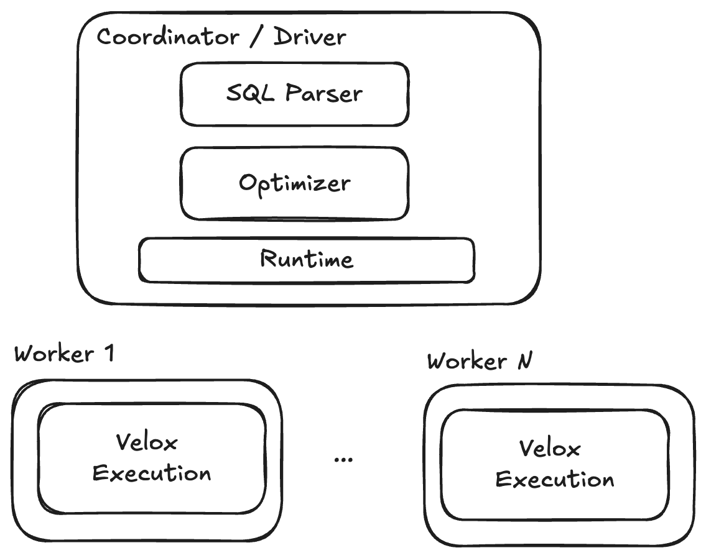
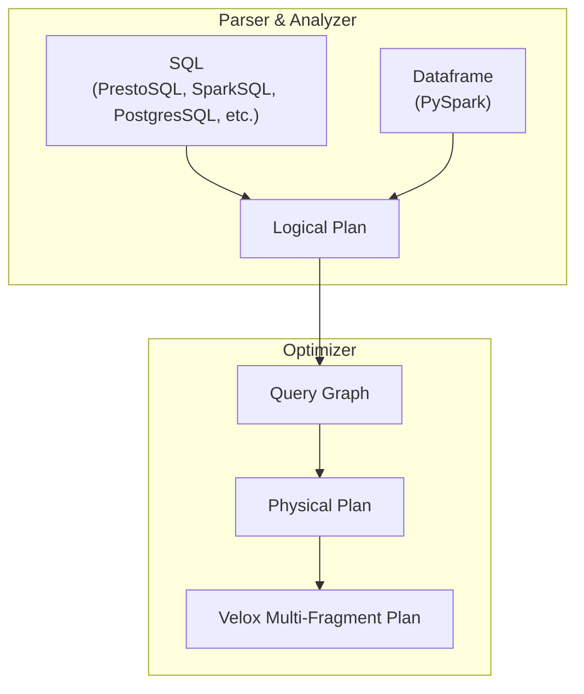

[](https://github.com/facebookincubator/axiom/actions/workflows/linux.yml)
[](https://github.com/facebookincubator/axiom/actions/workflows/macos.yml)

## License

Axiom is licensed under the Apache 2.0 License. A copy of the license
[can be found here.](LICENSE)

## Getting Started

### Get the Source

```
git clone --recursive https://github.com/facebookincubator/axiom.git
cd axiom
```

If you already cloned without `--recursive`, initialize the Velox submodule:

```
git submodule sync --recursive
git submodule update --init --recursive
```

### System Requirements

Axiom requires a C++20 compiler. Supported platforms:

- **Linux**: Ubuntu 22.04+ with gcc 11+ (tested up to gcc 14) or clang 15+
- **macOS**: macOS 13+ with Apple Clang 15+ (Xcode 15+)

### Setting up Dependencies

Axiom uses Velox's dependency setup scripts. On macOS, dependencies are
installed to `deps-install/` by default. Set `INSTALL_PREFIX` to control
the installation directory:

```
export INSTALL_PREFIX=$(pwd)/deps-install
```

Then run the appropriate script for your platform:

**macOS:**

```
VELOX_BUILD_SHARED=ON PROMPT_ALWAYS_RESPOND=y velox/scripts/setup-macos.sh
```

**Ubuntu:**

```
VELOX_BUILD_SHARED=ON PROMPT_ALWAYS_RESPOND=y velox/scripts/setup-ubuntu.sh
```

`VELOX_BUILD_SHARED=ON` ensures dependencies are built for shared linking,
which is required by the Velox mono library used in Axiom.

### Building

On macOS, pass the path to the installed dependencies via `EXTRA_CMAKE_FLAGS`:

```
EXTRA_CMAKE_FLAGS="-DCMAKE_PREFIX_PATH=$(pwd)/deps-install" make debug
```

Other build targets:

```
make release                        # optimized build
make unittest                       # build and run tests
```

### Running Tests

```
ctest --test-dir _build/debug -j 8 --output-on-failure
```

To run a subset of test executables, use `-R` with a regex. Add `-N`
to list matching tests without running them.

```
ctest --test-dir _build/debug -R axiom_optimizer      # run all optimizer tests
ctest --test-dir _build/debug -R axiom_cli_test       # run CLI tests only
```

To run individual test cases within an executable, use `--gtest_filter`:

```
_build/debug/axiom/optimizer/tests/axiom_optimizer_tests --gtest_filter="AggregationPlanTest.*"
```

### Try the CLI

The interactive SQL CLI runs queries against an in-memory TPC-H dataset:

```
_build/debug/axiom/cli/axiom_sql
```

```
SQL> select count(*) from nation;
ROW<count:BIGINT>
-----
count
-----
   25
(1 rows in 1 batches)
```

### Query Your Own Data

The [Hive connector](axiom/connectors/hive/README.md) can query Parquet,
DWRF, and CSV files on the local filesystem. Each subdirectory under the
data path is treated as a table.

#### Parquet Files

For Parquet (and DWRF) files, use `axiom_import` to auto-infer schema and
compute statistics from file headers.

The example below uses the [NYC Taxi & Limousine Commission Trip Record
Data](https://www.nyc.gov/site/tlc/about/tlc-trip-record-data.page) — a
public dataset of ~3 million yellow taxi trips from January 2024 (~50 MB).

**1. Download the data:**

```bash
mkdir -p /tmp/nyc_taxi/trips
curl -o /tmp/nyc_taxi/trips/yellow_tripdata_2024-01.parquet \
  https://d37ci6vzurychx.cloudfront.net/trip-data/yellow_tripdata_2024-01.parquet
```

**2. Import (generate `.schema` and `.stats` metadata):**

```bash
_build/debug/axiom/cli/axiom_import --data_path /tmp/nyc_taxi
```

```
Importing 1 table(s) from '/tmp/nyc_taxi' (format: parquet)
  trips ... done (0.42s)
Import complete.
```

**3. Query:**

```bash
_build/debug/axiom/cli/axiom_sql --data_path /tmp/nyc_taxi
```

```
SQL> SELECT count(*) FROM trips;
-------
  count
-------
2964624

SQL> SELECT passenger_count, avg(total_amount) AS avg_total
     FROM trips GROUP BY 1;
----------------+-----------
passenger_count | avg_total
----------------+-----------
              1 |     26.21
              2 |     29.52
              3 |     29.14
...
```

To add more months, download additional files into the same `trips/`
directory and re-run `axiom_import`.

#### CSV Files

For CSV files, create the table with schema first, then copy the files in.

**1. Create the data directory and the table with schema:**

```bash
mkdir -p /tmp/my_data
_build/debug/axiom/cli/axiom_sql --data_path /tmp/my_data --data_format text \
  --query "CREATE TABLE sales (id INTEGER, name VARCHAR, amount DOUBLE)
           WITH (file_format = 'text', \"field.delim\" = ',')"
```

**2. Copy CSV files into the table directory:**

```bash
cp data.csv /tmp/my_data/sales/
```

Optionally, run `axiom_import` to collect column statistics for the
optimizer:

```bash
_build/debug/axiom/cli/axiom_import --data_path /tmp/my_data --data_format text
```

**3. Query:**

```bash
_build/debug/axiom/cli/axiom_sql --data_path /tmp/my_data --data_format text
```

```
SQL> SELECT * FROM sales;
---+-------+-------
id | name  | amount
---+-------+-------
 1 | Alice |  100.5
 2 | Bob   |    200
 3 | Carol | 150.75
```

## Code Organization

Axiom is a set of reusable and extensible components designed to be compatible
with Velox. These components are:

- [SQL Parser](axiom/sql/presto/README.md) compatible with PrestoSQL dialect.
  - top-level “sql” directory
- Logical Plan - a representation of SQL relations and expressions.
  - top-level “logical_plan” directory
- Cost-based [Optimizer](axiom/optimizer/README.md) compatible with Velox
  execution.
  - top-level “optimizer” directory
- Query Runner capable of orchestrating multi-stage Velox execution.
  - top-level “runner” directory
- Connector - an extention of Velox Connector APIs to provide functionality
  necessary for query parsing and planning.
  - top-level “connectors” directory
  - [Hive](axiom/connectors/hive/README.md) — Local filesystem connector for Parquet, DWRF, and TEXT (including CSV) files.
  - [TPC-H](axiom/connectors/tpch/README.md) — Read-only, in-memory TPC-H benchmark data.
  - [Test](axiom/connectors/tests/README.md) — In-memory read-write connector for unit testing.
- [CLI](axiom/cli/README.md) - Interactive SQL command line for executing
  queries against in-memory TPC-H dataset and local Hive data.
  - top-level “cli” directory

These components can be used to put together single-node or distributed
execution. Single-node execution can be single-threaded or multi-threaded.



The query processing flow goes like this:


```mermaid
flowchart TD
    subgraph p[Parser & Analyzer]
        sql["`SQL
        (PrestoSQL, SparkSQL, PostgresSQL, etc.)`"]
        df["`Dataframe
        (PySpark)`"]
        sql --> lp[Logical Plan]
        df --> lp
    end

    subgraph o[Optimizer]
        lp --> qg[Query Graph]
        qg --> plan[Physical Plan]
        plan --> velox[Velox Multi-Fragment Plan]
    end
```

SQL Parser parses the query into Abstract Syntax Tree (AST), then resolves names
and types to produce a Logical Plan. The Optimizer takes a Logical Plan and
produces an optimized executable multi-fragment Velox plan. Finally, LocalRunner
creates and executed Velox tasks to produce a query result.

EXPLAIN command can be used to print an optimized multi-fragment Velox plan
without executing it.

```
SQL> explain  select count(*) from nation;
Fragment 0: stage1 numWorkers=4:
-- PartitionedOutput[2][SINGLE Presto] -> count:BIGINT
  -- Aggregation[1][PARTIAL count := count()] -> count:BIGINT
    -- TableScan[0][table: nation, scale factor: 0.01] ->
       Estimate: 25 rows, 0B peak memory

Fragment 1:  numWorkers=1:
-- Aggregation[5][FINAL count := count("count")] -> count:BIGINT
  -- LocalPartition[4][GATHER] -> count:BIGINT
    -- Exchange[3][Presto] -> count:BIGINT
       Input Fragment 0
```

EXPLAIN ANALYZE command can be used to execute the query and print Velox plan
annotated with runtime statistics.

```
SQL> explain analyze select count(*) from nation;
Fragment 0: stage1 numWorkers=4:
-- PartitionedOutput[2][SINGLE Presto] -> count:BIGINT
   Output: 16 rows (832B, 16 batches), Cpu time: 545.76us, Wall time: 643.00us, Blocked wall time: 0ns, Peak memory: 16.50KB, Memory allocations: 80, Threads: 16, CPU breakdown: B/I/O/F (56.46us/91.04us/369.00us/29.26us)
  -- Aggregation[1][PARTIAL count := count()] -> count:BIGINT
     Output: 16 rows (512B, 16 batches), Cpu time: 548.82us, Wall time: 619.02us, Blocked wall time: 0ns, Peak memory: 64.50KB, Memory allocations: 80, Threads: 16, CPU breakdown: B/I/O/F (48.04us/18.53us/451.92us/30.33us)
    -- TableScan[0][table: nation, scale factor: 0.01] ->
       Estimate: 25 rows, 0B peak memory
       Input: 25 rows (0B, 1 batches), Output: 25 rows (0B, 1 batches), Cpu time: 1.43s, Wall time: 1.43s, Blocked wall time: 7.20ms, Peak memory: 97.75KB, Memory allocations: 10, Threads: 16, Splits: 1, CPU breakdown: B/I/O/F (24.86us/0ns/1.43s/4.46us)

Fragment 1:  numWorkers=1:
-- Aggregation[5][FINAL count := count("count")] -> count:BIGINT
   Output: 1 rows (32B, 1 batches), Cpu time: 72.03us, Wall time: 84.37us, Blocked wall time: 0ns, Peak memory: 64.50KB, Memory allocations: 5, Threads: 1, CPU breakdown: B/I/O/F (8.22us/53.59us/6.62us/3.60us)
  -- LocalPartition[4][GATHER] -> count:BIGINT
     Output: 32 rows (384B, 8 batches), Cpu time: 153.32us, Wall time: 1.16ms, Blocked wall time: 1.42s, Peak memory: 0B, Memory allocations: 0, CPU breakdown: B/I/O/F (20.37us/103.67us/20.78us/8.50us)
    -- Exchange[3][Presto] -> count:BIGINT
       Input: 16 rows (192B, 4 batches), Output: 16 rows (192B, 4 batches), Cpu time: 266.95us, Wall time: 299.90us, Blocked wall time: 5.70s, Peak memory: 320B, Memory allocations: 5, Threads: 4, Splits: 4, CPU breakdown: B/I/O/F (172.46us/0ns/93.41us/1.08us)
       Input Fragment 0
```

## Advance Velox Version

Axiom integrates Velox as a Git submodule, referencing a specific commit of the
Velox repository. Advance Velox when your changes depend on code in Velox that
is not available in the current commit. To update the Velox version, follow
these steps:

- `git -C velox checkout main`
- `git -C velox pull`
- `git add velox`
- Build and run tests to ensure everything works.
- Submit a PR, get it approved and merged.
