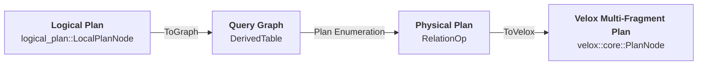
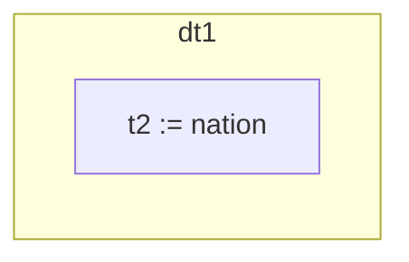
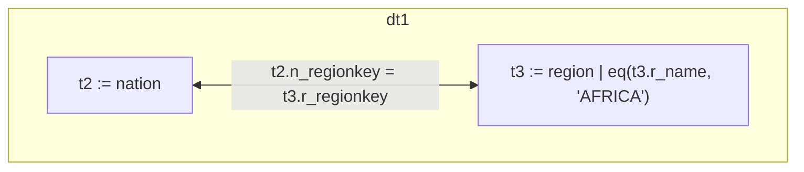
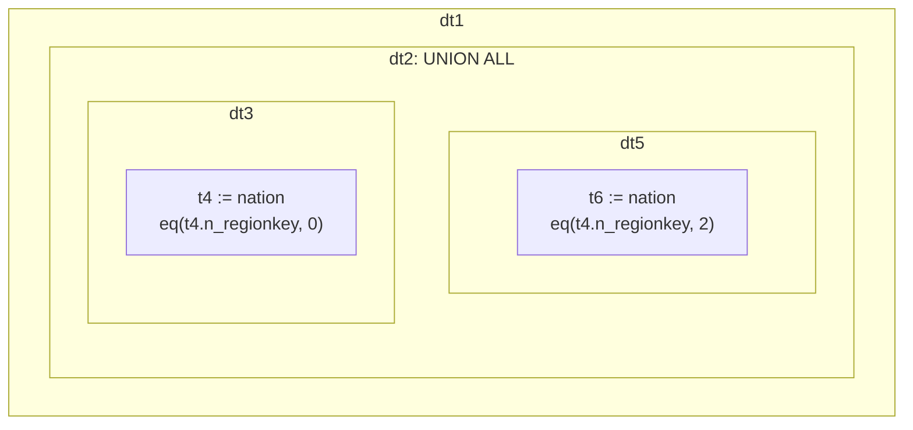

# Overall Flow

The optimizer's input is Logical Plan. This is a tree of relational plan nodes defined using a hierarchy of logical_plan::LogicalPlanNode and logical_plan::Expr classes. Operations represented by the Logical Plan are fully typed and resolved. All names have been bound to schema objects and each operation has defined input and output types.

To produce an executable plan, the Optimizer converts Logical Plan to a Query Graph, runs cost-based plan enumeration algorithm to produce optimal physical plan, then converts physical plan to a multi-fragment Velox executable plan.



# Terminology

BaseTable
: A reference to a table from a query. There is one of these for each occurrence of the schema table.

DerivedTable
: Represents a SELECT in a FROM clause. This is the basic unit of planning.

Correlation name
: Unique name of a base or derived table in a query graph. Each table is assigned a unique correlation name. Table columns are qualified using table's correlation name: cname.name. This supports plans where multiple tables have columns with same names.

Join Edge
: An edge in a QueryGraph that represents a join between two tables.

Fanout
: Join fanout or one-to-many join refers to a situation where one row in a table joins to multiple rows in another table. This means the number of rows in the joined result set can be greater than the number of rows in the primary (left) table.

Conjunction
: A statement formed by adding two statements with the connector AND. Individual statements are called conjuncts.

Disjunction
: A statement formed by adding two statements with the connector OR. Individual statements are called disjuncts.

Negation
: A statement formed by adding a NOT to a statement.

> [!NOTE]
> De Morgan's Laws:
> * Negation of a conjunction: The negation of an AND statement is equivalent to the OR of the individual negations.
>   * not(a AND b) <==> not(a) OR not(b)
> * Negation of a disjunction: The negation of an OR statement is equivalent to the AND of the individual negations.
>   * not(a OR b) <==> not(a) AND not(b)

# Abbreviations

QG
: QueryGraph

DT
: DerivedTable

CName
: Correlation name.

XxxP
: Raw pointer to Xxx: XxxP := Xxx*

XxxCP
: Raw pointer to constant Xxx: XxxCP := const Xxx*. Remember to place 'const' *after* the type: XxxCP const variableName. (const XxxCP doesn't produce the desired effect.)

XxxVector
: Standard vector of raw pointers to Xxx allocated from the arena: XxxVector := `QGVector<XxxP>`.

CPSpan<T>
: A view on an array of const raw pointers `CPSpan<T> := std::span<const T* const>`;

LRFanout
: Left-to-Right Fanout. The average number of right side rows selected for one row on the left.

RLFanout
: Right-to-Left Fanout. The average number of left side rows selected for one row on the right.

# Memory Management

Query Graph objects are allocated from an arena and have the lifetime of the optimization. These are dropped wholesale at the end without invoking destructors. Physical Plan objects (RelationOp) are allocated with malloc and managed using smart pointers.

QGAllocator
: STL compatible allocator that manages std:: containers allocated in the QueryGraphContext arena. Use `make<T>(<args>)` to allocate a new object of type T from the arena.

Name
: Pointer to an arena allocated interned copy of a null terminated string. Used for identifiers. Allows comparing strings by comparing pointers. `Name := const char*`. Use `toName(<string>)` to convert an external string.

# Query Graph

Query Graph consists of nodes and edges. Nodes represent tables. Edges represent joins. A node represents either a schema table backed by a Connector (BaseTable), an ephemeral in-memory table created using Values logical node (ValuesTable), or a derived table (DerivedTable).

A BaseTable may include a filter.

A DerivedTable corresponds to a single SELECT clause and includes the following:
* One or more tables (a mix of ValueTable, BaseTable and DerivedTable is allowed)
* [Optional] Joins.
* [Optional] Filter conjuncts that depend on two or more tables and do not represent join conditions.
* [Optional] Aggregation with an optional HAVING clause.
* [Optional] OrderBy clause.
* [Optional] Limit and offset.

The order of operations in a DerivedTable follows SQL order:
1. Table scans
1. Joins
1. Filters
1. Aggregation
1. Having clause
1. Order By
1. Offset
1. Limit

Consider a simple count(*) query.

```
SQL> EXPLAIN (TYPE GRAPH) SELECT count(*) FROM nation;
dt1: count
  output:
    count := dt1.count
  tables: t2
  aggregates: count() AS count

t2:
  table: tiny.nation
```

The query graph consists of a BaseTable t2 that represents ‘nation’ and a DerivedTable dt1 that represents an aggregation over t2.



A bit more involved query would count the number of African nations by joining nation and region tables.

```
SQL> EXPLAIN (TYPE GRAPH) SELECT count(*) FROM nation, region WHERE n_regionkey = r_regionkey and r_name = 'AFRICA';
dt1: count
  output:
    count := dt1.count
  tables: t2, t3
  joins:
    t2 INNER t3 ON t2.n_regionkey = t3.r_regionkey
  syntactic join order: 5, 10
  aggregates: count() AS count

t2: n_regionkey
  table: tiny.nation

t3: r_regionkey, r_name
  table: tiny.region
  single-column filters: eq(t3.r_name, "AFRICA")
```

The query graph consists of two BaseTables t2 and t3 that represent ‘nation’ and 'region' tables, and a DerivedTable dt1 that represents an aggregation over join of t2 and t3. BaseTable t3 represents table 'region' with a filter: r_name = 'AFRICA'.



Each object in a query graph has a unique ID and type. These are stores in PlanObject base class. IDs are unique across all objects. IDs are sequential numbers assigned at object's creation time using a single counter stored in QueryGraphContext. An ID can be used to lookup an object from the context.

```c++
struct BaseTable : public PlanObject {
  BaseTable() : PlanObject(PlanType::kTableNode) {}


class PlanObject {
 public:
  explicit PlanObject(PlanType type)
      : type_(type), id_(queryCtx()->newId(this)) {}


class QueryGraphContext {

  /// Returns a new unique id to use for 'object' and associates 'object' to
  /// this id. Tagging objects with integer ids is useful for efficiently
  /// representing sets of objects as bitmaps.
  int32_t newId(PlanObject* object) {
    objects_.push_back(object);
    return static_cast<int32_t>(objects_.size() - 1);
  }

  /// Returns the object associated to 'id'. See newId()
  PlanObjectCP objectAt(int32_t id) {
    return objects_[id];
  }
```

Graph graph object types are described by PlanType enum. There are 2 classes of objects: expressions and plan nodes.

```c++
enum class PlanType : uint32_t {
  // Expressions.
  kColumnExpr = 0,
  kLiteralExpr,
  kCallExpr,
  kAggregateExpr,
  kFieldExpr,
  kLambdaExpr,
  // Plan nodes.
  kTableNode,
  kValuesTableNode,
  kUnnestTableNode,
  kDerivedTableNode,
  kAggregationNode,
  kProjectNode,
  kFilterNode,
  kJoinNode,
  kOrderByNode,
  kLimitNode,
  kWriteNode,
};
```

ToGraph::makeQueryGraph API is used to convert a Logical Plan to a Query Graph.

## Set Operations

Axiom supports UNION, UNION ALL, INTERSECT and EXCEPT set operations.

In a query graph, a set operation is represented by a special kind of DerivedTable that stores set operation type and a list of child DerivedTables.

Here is an example of a UNION ALL query that combines two tables with simple filters.

```
SQL> EXPLAIN (TYPE GRAPH) SELECT * FROM nation WHERE n_regionkey = 0 UNION ALL SELECT * FROM nation WHERE n_regionkey = 2;
dt1: n_nationkey, n_name, n_regionkey, n_comment
  output:
    n_nationkey := dt2.n_nationkey
    n_name := dt2.n_name
    n_regionkey := dt2.n_regionkey
    n_comment := dt2.n_comment
  tables: dt2

dt2: n_nationkey, n_name, n_regionkey, n_comment
  UNION ALL: dt3, dt5

dt3: n_nationkey, n_name, n_regionkey, n_comment
  output:
    n_nationkey := t4.n_nationkey
    n_name := t4.n_name
    n_regionkey := t4.n_regionkey
    n_comment := t4.n_comment
  tables: t4

t4: n_nationkey, n_name, n_regionkey, n_comment
  table: tiny.nation
  single-column filters: eq(t4.n_regionkey, 0)

dt5: n_nationkey, n_name, n_regionkey, n_comment
  output:
    n_nationkey := t6.n_nationkey
    n_name := t6.n_name
    n_regionkey := t6.n_regionkey
    n_comment := t6.n_comment
  tables: t6

t6: n_nationkey, n_name, n_regionkey, n_comment
  table: tiny.nation
  single-column filters: eq(t6.n_regionkey, 2)
```

DerivedTable dt2 represents UNION ALL of dt5 and dt3.


