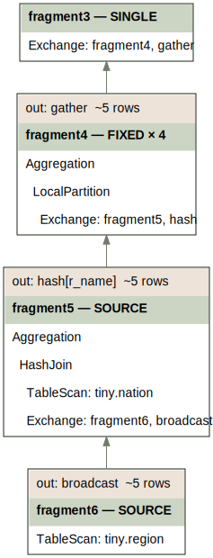
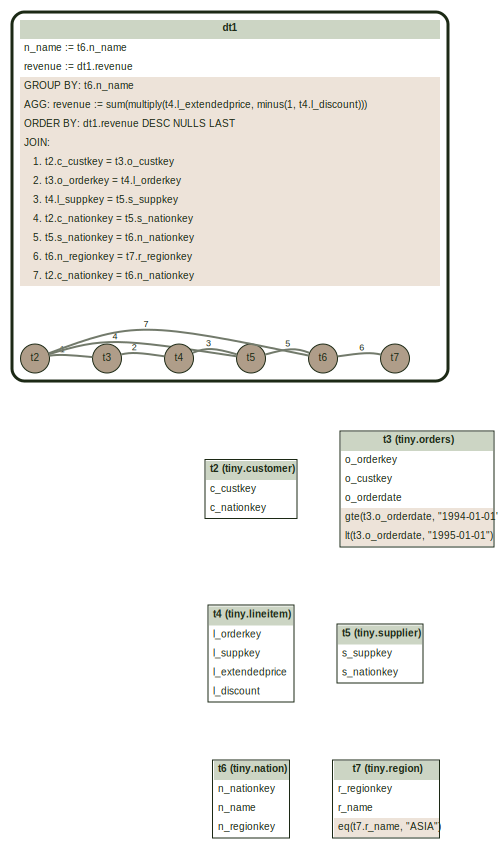

# Visualization CLI

A command-line tool to generate visual diagrams of query graphs, logical plans,
and multi-fragment plans from SQL queries using
[Graphviz](https://graphviz.org/).

## Overview

The `axiom/cli:graphviz` CLI parses a SQL query and produces a
[DOT](https://graphviz.org/doc/info/lang.html) representation of one of:

- **Query graph** (`--mode=graph`, default) — the parsed query structure
  showing tables, joins, filters, and aggregations (the output of `ToGraph`).
- **Logical plan** (`--mode=logical`) — the optimized logical plan tree
  (the output of `Optimization::bestPlan`).
- **Distributed plan** (`--mode=distributed`) — the multi-fragment
  execution plan as a graph of fragments connected by exchanges (the output
  of `ToVelox`).

When the output file has an `.svg` extension, the tool automatically invokes the
`dot` command to render SVG.  Otherwise it writes the raw DOT file.

## Prerequisites

To generate SVG output, you need the `dot` command from Graphviz:

```bash
sudo apt install graphviz
```

The tool looks for `dot` in `/usr/bin/dot`, `/usr/local/bin/dot`, and
`/opt/homebrew/bin/dot`.

## Usage

```
buck run axiom/cli:graphviz -- --query "SELECT ..." --output <file>
```

Or pipe the query via stdin:

```
echo "SELECT ..." | buck run axiom/cli:graphviz -- --query "" --output <file>
```

### Flags

| Flag | Default | Description |
|------|---------|-------------|
| `--query` | (stdin) | SQL query. If empty, reads from stdin |
| `--output` | (required) | Output file path. Use `.svg` extension to generate SVG; otherwise generates a DOT file |
| `--mode` | `graph` | Visualization mode: `graph`, `logical`, or `distributed` |
| `--num_workers` | `4` | Number of workers (only used by `--mode=distributed`) |
| `--num_drivers` | `4` | Number of drivers per worker (only used by `--mode=distributed`) |
| `--data_path` | (empty) | Path to directory with local tables. If empty, uses TPC-H tables |
| `--data_format` | `parquet` | Format of local tables: `parquet`, `dwrf`, or `text` |

## Examples

### Generate query graph as SVG

```bash
buck run axiom/cli:graphviz -- \
  --query "SELECT r_name, count(*) FROM region, nation WHERE r_regionkey = n_regionkey GROUP BY 1" \
  --output query.svg
```


### Generate logical plan as SVG

```bash
buck run axiom/cli:graphviz -- \
  --mode=logical \
  --query "SELECT r_name, count(*) FROM region, nation WHERE r_regionkey = n_regionkey GROUP BY 1" \
  --output plan.svg
```


### Generate distributed plan as SVG

```bash
buck run axiom/cli:graphviz -- \
  --mode=distributed \
  --query "SELECT r_name, count(*) FROM region, nation WHERE r_regionkey = n_regionkey GROUP BY 1" \
  --output plan.svg
```



### Generate DOT file (no rendering)

```bash
buck run axiom/cli:graphviz -- \
  --query "SELECT r_name, count(*) FROM region, nation WHERE r_regionkey = n_regionkey GROUP BY 1" \
  --output query.dot
```

You can then render the DOT file manually:

```bash
dot -Tsvg query.dot -o query.svg
dot -Tpng query.dot -o query.png
```

### Visualize a TPC-H query

```bash
buck run axiom/cli:graphviz -- \
  --query "$(cat axiom/optimizer/tests/tpch/queries/q5.sql)" \
  --output q5.svg
```

**TPC-H q5** — 6-way join with filters, aggregation, and ordering.



### Use local tables

By default, the tool resolves table names against built-in TPC-H tables.
Use `--data_path` to query your own data instead. This registers a
HiveConnector, so files must be arranged in the expected layout: each
subdirectory under `--data_path` is a table, and the subdirectory name
becomes the table name.

```
/home/$USER/my_data/
  ├── orders/
  │   └── data.parquet
  └── customers/
      └── data.parquet
```

```bash
buck run axiom/cli:graphviz -- \
  --data_path /home/$USER/my_data/ \
  --data_format parquet \
  --query "SELECT count(*) FROM orders" \
  --output orders.svg
```

> See [`axiom/cli/README.md`](../../cli/README.md) for the full set of CLI
> flags and the catalog of available connectors.

## Query Graph Visualization

The query graph is a hierarchical diagram showing the structure of a parsed SQL query.

### Visual Elements

| Element | Appearance | Description |
|---------|------------|-------------|
| **DerivedTable (DT)** | Rounded rectangle cluster | A query block containing tables, joins, and output expressions |
| **Root DT** | Thick border | The top-level query |
| **Nested DT** | Thin border | Subqueries |
| **Base Table** | Table box | Physical table reference |
| **Values Table** | Table box with "VALUES" label | Inline row values |
| **Unnest Table** | Table box with "UNNEST" label | An unnest operation |

### DerivedTable Box Contents

Each DT displays:

- **Output columns** — column names and expressions (e.g., `col := expr`)
- **GROUP BY** — grouping key expressions
- **AGG** — aggregate functions (e.g., `total := sum(amount)`)
- **ORDER BY** — sort keys with direction (ASC/DESC)
- **JOIN** — numbered join conditions with type (LEFT, SEMI, ANTI, CROSS; INNER is omitted)
- **FILTER** — filter predicates (truncated to 80 chars)

### Join Edges

Join edges connect table ID nodes within each DT cluster:

- **Numbered labels** correspond to the JOINS list in the DT header.
- **Bidirectional edges** (no arrow) indicate commutative joins (INNER, FULL).
- **Directional edges** (arrow) indicate non-commutative joins (LEFT, RIGHT, SEMI, ANTI, UNNEST).

### Layout

Table boxes are arranged in a 2-column grid below each DT cluster, with
invisible edges controlling positioning.

## Distributed Plan Visualization

The multi-fragment plan diagram shows the distributed execution plan as a
graph of fragment boxes connected by exchange edges. See
[Distributed Execution](DistributedExecution.md) for the underlying model.

### Fragment Box

Each fragment is rendered as a box containing three parts, top to bottom:

- **`out:` row** — the fragment's output distribution (read from the root
  `PartitionedOutputNode`) and the estimated row count, e.g.
  `out: hash[k]   ~60,000 rows`. Omitted when the fragment delivers results
  in-process (final fragment with no `PartitionedOutputNode`).
- **Header row** — `taskPrefix — FragmentType` (and `× width` when the
  fragment has a fixed task count, i.e. `kFixed`).
- **Body** — the Velox plan tree, indented to preserve structure, with node
  type names only. The root `PartitionedOutputNode` and any `ProjectNode`
  are skipped as structural noise. Selected node types include a short
  detail suffix:
  - `Exchange: stageN, kind` and `MergeExchange: stageN, kind` — producer
    task prefix and the producer fragment's distribution kind.
  - `TableScan: name` — the table name from the connector handle.
  - `Limit: N` (or `Limit: N (offset M)` when offset is set).
  - `TopN: N`.

### Output Distribution

The `out:` row shows how the fragment's output is partitioned for downstream
consumption:

- `hash[...]` — hash-partitioned on the listed keys.
- `broadcast` — each producer task replicates its output to every consumer.
- `gather` — all producers send to a single consumer task.
- `arbitrary` — each row goes to an arbitrary consumer task.

### Fragment Type

The `FragmentType` in the header indicates how the fragment's tasks are
scheduled:

- `kSource` — parallelism determined by the data source (number of splits).
- `kFixed` — exactly `width` tasks.
- `kSingle` — exactly 1 task, any worker.
- `kCoordinator` — exactly 1 task, on coordinator.

### Edges

A directed edge from fragment A to fragment B indicates that A produces input
for B. The receiving `Exchange` (or `MergeExchange`) row in B's body is
annotated with the producing task prefix and distribution kind, e.g.
`Exchange: fragment17, hash`, so each incoming edge can be matched to a
specific consumer node.

## Pre-generated TPC-H Query Graphs

Pre-generated SVGs for all 22 TPC-H queries are available in:

- [`axiom/optimizer/tests/tpch/viz/graph/`](../tests/tpch/viz/graph/) — query graphs
- [`axiom/optimizer/tests/tpch/viz/distributed/`](../tests/tpch/viz/distributed/) — distributed plans
